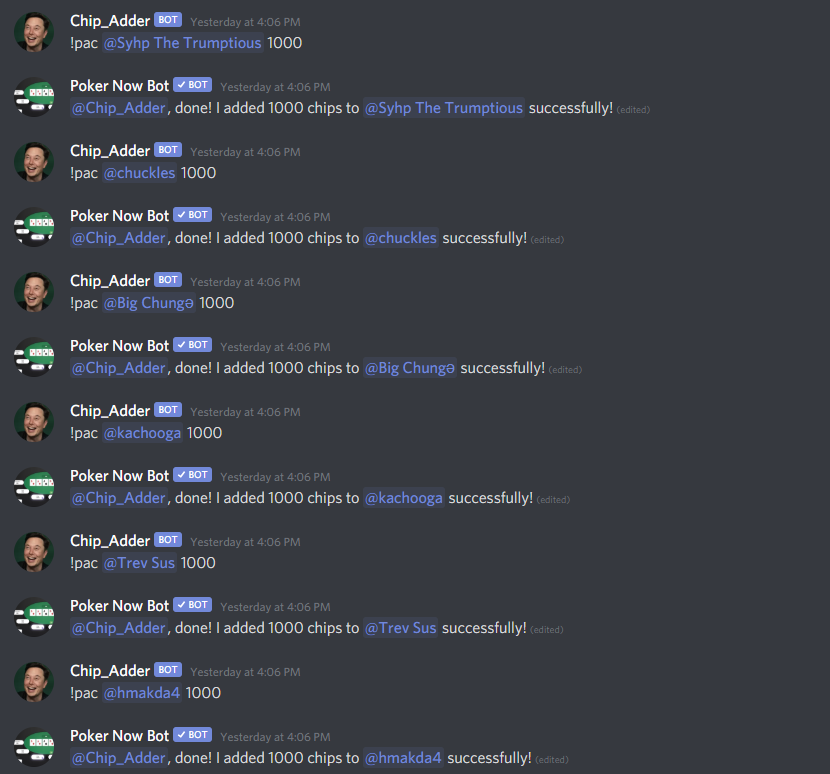
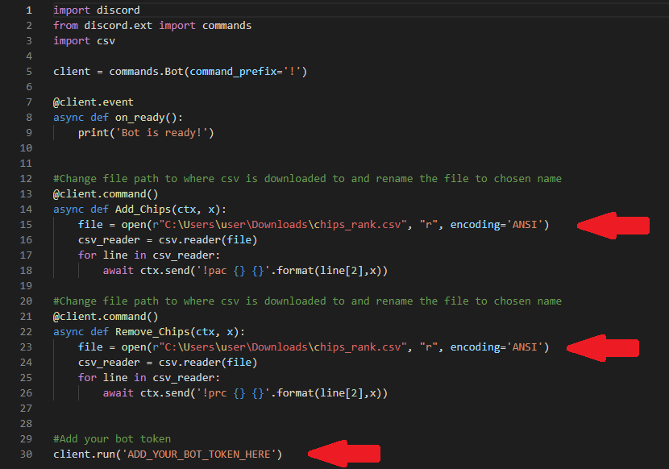

## Background
 This bot was created in response to a discord server which had a large number of users who were using the poker now discord app
 as well as a significant number of users who were not. A problem arose when we wanted to add chips to all users playing without 
 having to repeat the command for adding chips each time for every user. The code below creates a bot which calls the command for
 adding chips to all current players using a single command.

## Example
 
 

## How to use the Bot
1. Run the  python file after making the recommened changes to the code detailed in the next section.
2. Download the csv containing every players rankings using the command !pcr all.
3. Change the name of this file to the one you specify in the changed code (again see below).
4. Type either the following commands to add/remove chips respectively !Add_Chips (amount) / !Remove_Chips (amount).

## Changes to Code (Required)
 The bot works on the basis that poker now has a downloadable folder which contains all the current players names when the
 command '!pcr all' is called. After the name of the folder has been changed, the bot iterates through the current players names
 and adds the chosen number of chips to every player.

 To implement this bot in your server you must change a few things in my code given to you, these are highlighted in the image 
 below: 

 * The file path of the downloaded csv must be changed to where it will be on ur computer.
 * The final file name of the csv must be changed to something of your choice, don't forget to change the name of the csv after
   downloading it.
 * The token of the bot you create must be added.

 

## Further Notes
 This bot can be used as a template to create a discord bot that iterates a command of another bot. Of which I couldn't find any 
 examples of before making this. Obviously, the constraint is this bot requires a list of names in a csv file, however there are 
 many solutions available if this is not ideal for your purpose.

 Finally this bot would not be needed without the highly polished poker now bot:
 [https://network.pokernow.club/poker_club_discord_bots](https://network.pokernow.club/poker_club_discord_bots "https://network.pokernow.club/poker_club_discord_bots")

